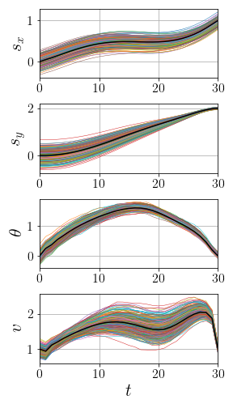
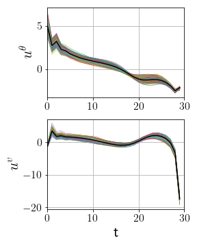
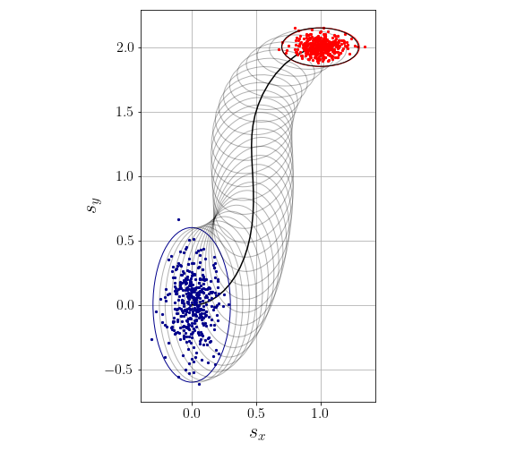

# greedyGPCS
Greedy Gaussian Process-Based Covariance Steering (GPCS)

## Setup

```sh
#!bash
$ pip install -r requirements.txt
$ python3 -m venv env
$ source env/bin/activate
$ pip install -r requirements.txt
$ python -m ipykernel install --user --name=env
`````````

## Train Stochastic Variational Gaussian Process

1. Generate some training data: [generate_data_simple_car.ipynb](generate_data_simple_car.ipynb)
2. Run stochastic gradient descent on GPyTorch GP model: [train_gp_simple_car.ipynb](train_gp_simple_car.ipynb)

## Run Covariance Steering

1. GP-based model: [CS_simple_car_GP.ipynb](CS_simple_car_GP.ipynb)
<p float="left">
  
   
  
</p>

2. Exact model: [CS_simple_car_exact.ipynb](CS_simple_car_exact.ipynb)
<p float="left">
  
   
  
</p>
