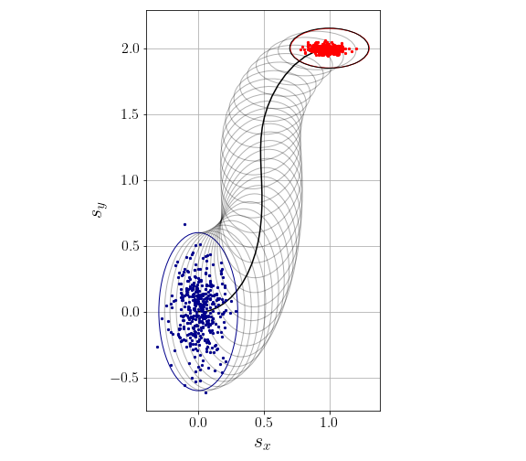

# greedyGPCS: Cautious Nonlinear Covariance Steering using Variational Gaussian Process Predictive Models

In this work, we consider the problem of steering the first two moments of the uncertain state of an unknown discrete-time stochastic nonlinear system to a given terminal distribution in finite time. Toward that goal, first, a non-parametric predictive model is learned from a set of available training data points using stochastic variational Gaussian process regression: a powerful and scalable machine learning tool for learning distributions over arbitrary nonlinear functions. Second, we formulate a tractable nonlinear covariance steering algorithm that utilizes the Gaussian process predictive model to compute a feedback policy that will drive the distribution of the state of the system close to the goal distribution. In particular, we implement a greedy covariance steering control policy that linearizes at each time step the Gaussian process model around the latest predicted mean and covariance, solves the linear covariance steering control problem, and applies only the first control law. The state uncertainty under the latest feedback control policy is then propagated using the unscented transform with the learned Gaussian process predictive model and the algorithm proceeds to the next time step. Numerical simulations illustrating the main ideas of this paper are also presented.

Presented at the Modeling, Estimation and Control Conference 2021. The arXiv paper can be found [here](https://arxiv.org/pdf/2010.00778.pdf).

## Setup

```sh
#!bash
$ python3 -m venv env
$ source env/bin/activate
$ pip install -r requirements.txt
$ python -m ipykernel install --user --name=env
`````````

## Train Stochastic Variational Gaussian Process

1. Generate some training data: [generate_data_simple_car.ipynb](generate_data_simple_car.ipynb)
2. Run stochastic gradient descent on GPyTorch-based GP model: [train_gp_simple_car.ipynb](train_gp_simple_car.ipynb)

## Run Covariance Steering

### SVGP Model

Run the notebook: [CS_simple_car_GP.ipynb](CS_simple_car_GP.ipynb)
<p float="left">
  
  
   
</p>

### Exact Model
Run the notebook: [CS_simple_car_exact.ipynb](CS_simple_car_exact.ipynb)
<p float="left">
  
  
   
</p>
